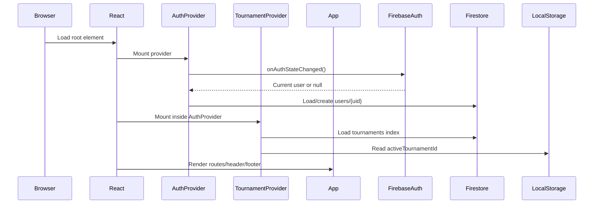
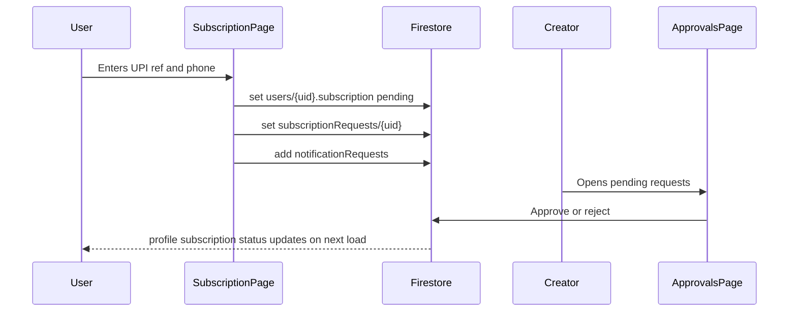
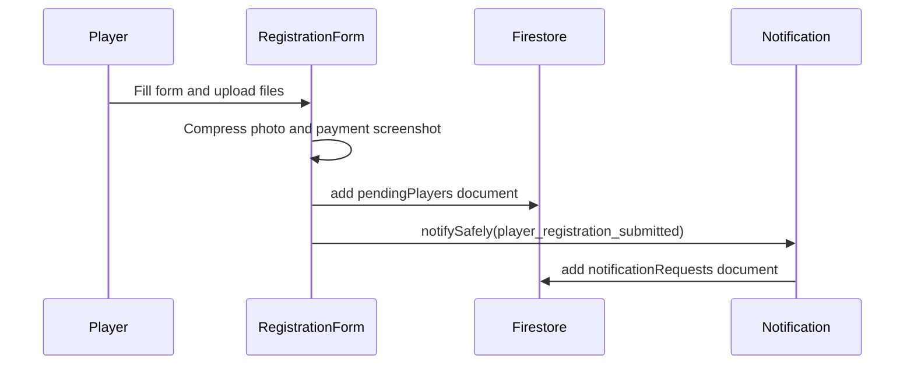
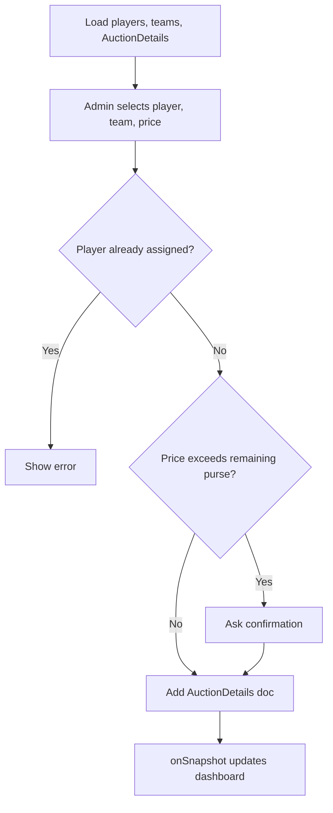
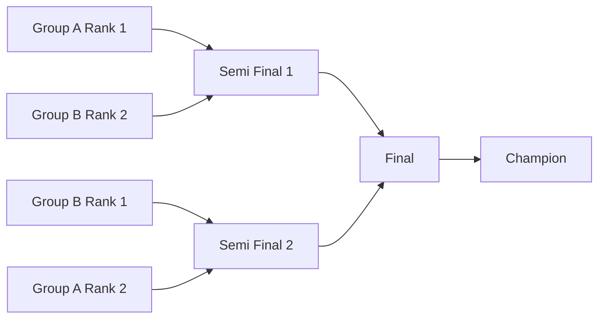
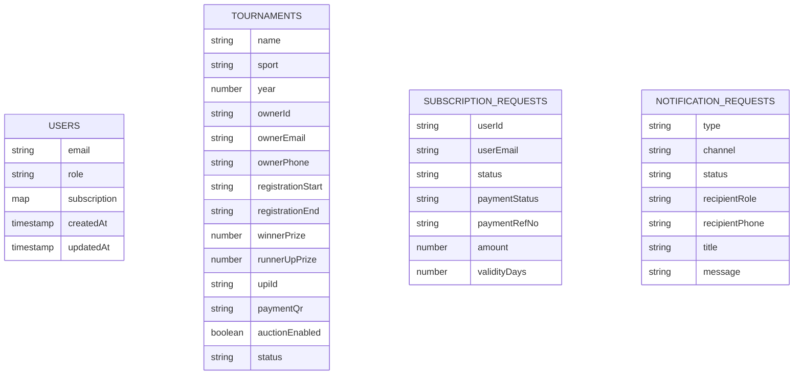
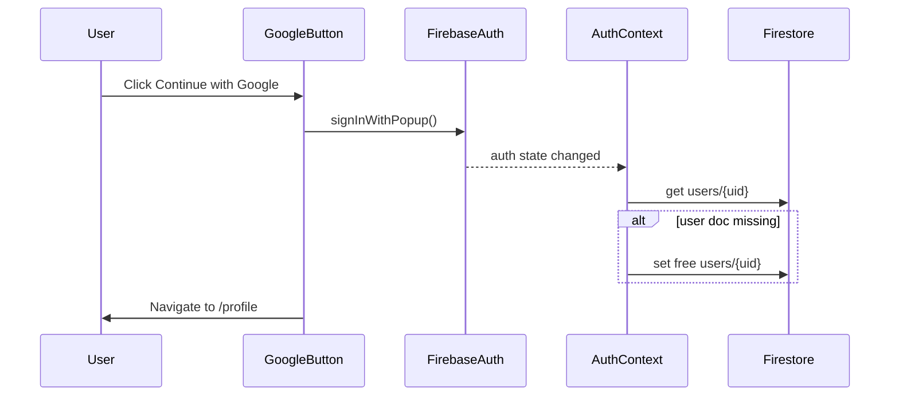
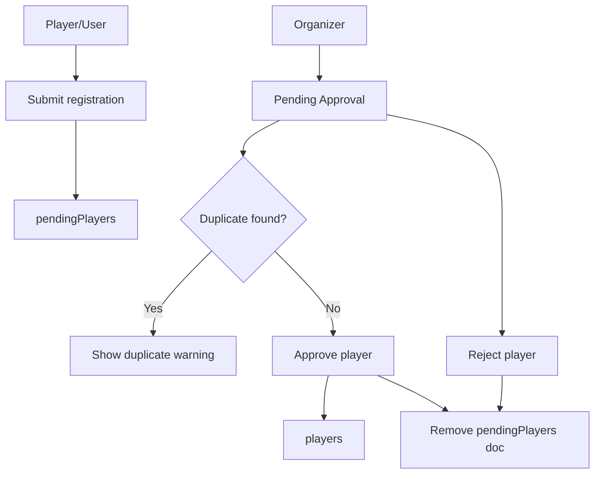
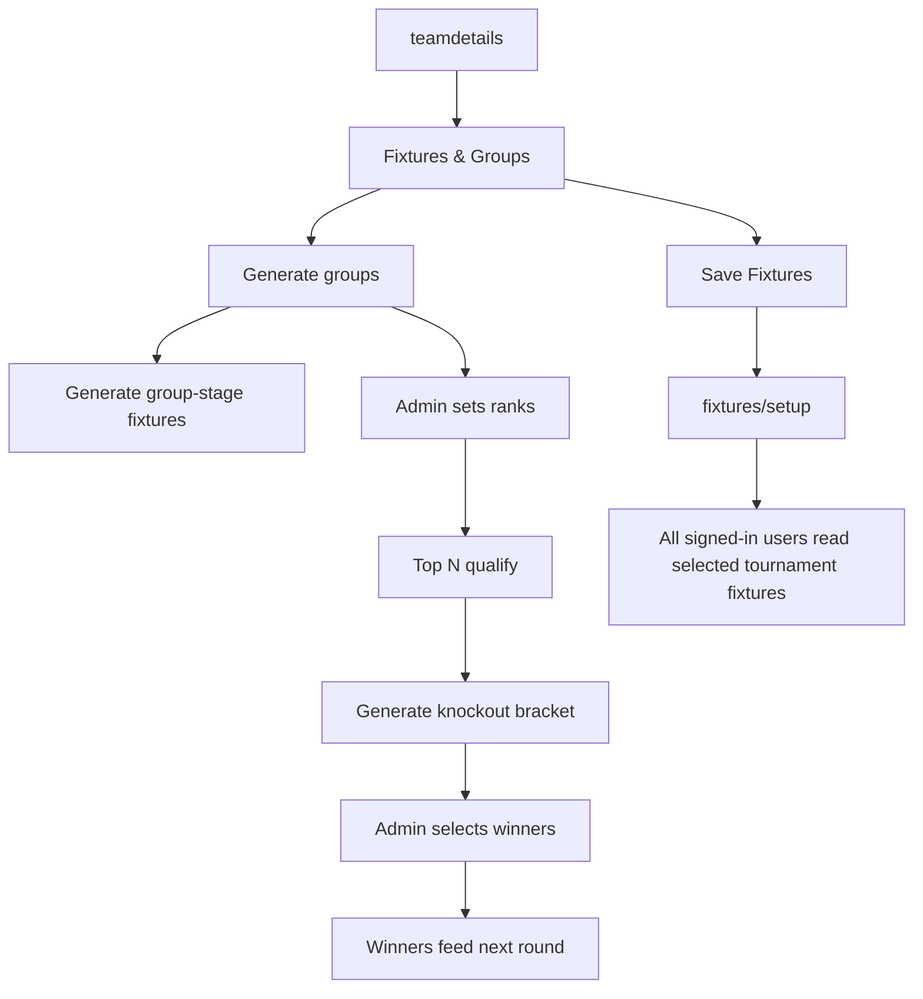

# LeagueCraft Application Documentation

LeagueCraft is a React + Firebase tournament management application for running cricket-style local tournaments. It supports Google sign-in, subscription-gated organizer access, tournament creation, player registration, approval workflows, team management, auction management, fixture/group planning, and read-only public views for selected tournament data.

This document describes the complete application structure, feature set, data flow, Firebase schema, routing, major components, functions, and security model.

## Table Of Contents

1. [Technology Stack](#technology-stack)
2. [High-Level Architecture](#high-level-architecture)
3. [Application Boot Flow](#application-boot-flow)
4. [Routing Map](#routing-map)
5. [Authentication And Roles](#authentication-and-roles)
6. [Tournament Context And Selection](#tournament-context-and-selection)
7. [Feature Modules](#feature-modules)
8. [Component And Function Reference](#component-and-function-reference)
9. [Firebase Data Model](#firebase-data-model)
10. [Security Rules](#security-rules)
11. [Storage Rules](#storage-rules)
12. [Key User Flows](#key-user-flows)
13. [Performance Notes](#performance-notes)
14. [Deployment Notes](#deployment-notes)
15. [Known Considerations And Extension Points](#known-considerations-and-extension-points)

## Technology Stack

| Layer | Technology | Purpose |
| --- | --- | --- |
| Frontend | React 18 | UI rendering and state-driven pages |
| Routing | React Router v6 | Client-side route protection and navigation |
| Styling | Tailwind CSS + custom CSS | Responsive tournament dashboard UI |
| Icons | lucide-react | Header icons, buttons, status visuals |
| Animation | framer-motion | Team reveal animations |
| Auth | Firebase Authentication | Google sign-in and user sessions |
| Database | Cloud Firestore | Users, tournaments, players, teams, auctions, fixtures, subscriptions |
| Storage | Firebase Storage rules present | Registration media path policy; current registration form stores compressed images as data URLs |
| Hosting | Firebase Hosting | App deployment target |
| Build | Create React App / react-scripts | Development and production builds |

## High-Level Architecture

```mermaid
flowchart TD
  Browser[User Browser] --> ReactApp[React App]
  ReactApp --> Router[React Router]
  Router --> Pages[Pages]
  Pages --> Contexts[AuthContext + TournamentContext]
  Pages --> FirebaseSDK[Firebase SDK]
  Contexts --> FirebaseSDK
  FirebaseSDK --> Auth[Firebase Auth]
  FirebaseSDK --> Firestore[Cloud Firestore]
  FirebaseSDK --> Storage[Firebase Storage]

  Firestore --> Users[(users)]
  Firestore --> Tournaments[(tournaments index)]
  Firestore --> YearTournament[(years/{year}/tournaments/{tournamentId})]
  YearTournament --> Pending[(pendingPlayers)]
  YearTournament --> Players[(players)]
  YearTournament --> Teams[(teamdetails)]
  YearTournament --> Auctions[(AuctionDetails)]
  YearTournament --> Fixtures[(fixtures/setup)]
  Firestore --> SubRequests[(subscriptionRequests)]
  Firestore --> Notifications[(notificationRequests)]
```

The app is a client-side React application. Firebase handles identity, authorization enforcement, database storage, and hosting. Most feature pages read/write Firestore directly through the Firebase SDK. Route guards and UI checks improve user experience, but Firestore rules remain the final authority.

## Application Boot Flow

Entry point: `src/index.js`



Important files:

- `src/index.js`: wraps `App` in `AuthProvider` and `TournamentProvider`.
- `src/App.js`: declares lazy-loaded routes and global shell.
- `src/firebase.js`: initializes Firebase and exports SDK helpers.

## Routing Map

Routes are declared in `src/App.js`. Most route components are lazy-loaded with `React.lazy()` for smaller initial bundles.

| Route | Component | Guard | Purpose |
| --- | --- | --- | --- |
| `/` | `Home` | Public | Landing/home view for selected tournament |
| `/login` | `Login` | Public | Google-only sign-in |
| `/signup` | `Signup` | Public | Google-only account entry |
| `/profile` | `Profile` | `ProtectedRoute` | User profile, active tournament selection, subscription status |
| `/subscription` | `Subscription` | `ProtectedRoute` | Submit premium organizer payment request |
| `/subscription-approvals` | `SubscriptionApprovals` | `ProtectedRoute` + creator UI check | Creator approves/rejects organizer subscriptions |
| `/tournaments` | `TournamentDirectory` | `ProtectedRoute` | Browse/select tournaments |
| `/manage-tournaments` | `TournamentManager` | `SubscriptionRoute` | Create tournaments and manage owned tournament workspace |
| `/registration` | `Registration` | `ProtectedRoute` | Player registration form for active tournament |
| `/registered-players` | `RegisteredPlayers` | `ProtectedRoute` | Read-only registered player list |
| `/player/:id` | `PlayerDetails` | `ProtectedRoute` | Legacy player detail lookup |
| `/pending-approval` | `PendingApproval` | `AdminRoute` | Tournament owner approves/rejects pending players |
| `/pending-player/:id` | `PendingPlayerDetails` | `AdminRoute` | Pending player detail view |
| `/create-team` | `TeamManager` | `SubscriptionRoute` | Create/edit/delete tournament teams |
| `/teams` | `TeamsDirectory` | `ProtectedRoute` | Read-only team directory |
| `/auction` | `AuctionManagerFull` | `ProtectedRoute` | Auction assignment dashboard; edits gated by tournament manager |
| `/fixtures` | `TournamentFixtures` | `ProtectedRoute` | Read-only fixtures for users; editable by tournament manager |
| `/team-reveal` | `TeamReveal` | `ProtectedRoute` | Animated team reveal experience |
| `/glimpse` | `TournamentGlimpses` | `ProtectedRoute` | Tournament media/gallery |
| `/payment` | `PaymentPage` | `ProtectedRoute` | Payment helper page |
| `/about` | `AboutPpl` | Public | About/history content |
| `/admin-login` | `AdminLogin` | `ProtectedRoute` | Legacy admin landing/redirect |

## Authentication And Roles

### Current Sign-In Model

User-facing login/signup is Google-only:

- `src/custom/GoogleLoginButton.js`
- `src/pages/Login.js`
- `src/pages/Signup.js`

`GoogleLoginButton` calls `signInWithPopup(auth, googleProvider)` and redirects to `/profile`.

### AuthContext

File: `src/context/AuthContext.js`

Responsibilities:

- Subscribe to Firebase auth state.
- Create a basic free user profile at `users/{uid}` if it does not exist.
- Load user role/profile/subscription.
- Compute subscription state.
- Expose logout.
- Submit subscription requests.
- Queue notification requests for creator review.

Provided values:

| Value | Meaning |
| --- | --- |
| `user` | Firebase user object |
| `role` | Role stored in Firestore, usually `user` or `admin` |
| `effectiveRole` | `admin` if creator, platform admin, or active subscriber |
| `profile` | Firestore `users/{uid}` data |
| `loading` | Auth loading state |
| `isSubscribed` | Active paid subscription status |
| `isCreator` | Whether current email matches creator email |
| `isSubscriptionPending` | Whether subscription request is awaiting approval |
| `isSubscriptionRejected` | Whether subscription request was rejected |
| `isSubscriptionExpired` | Whether paid subscription is expired |
| `subscriptionExpiresAt` | Date object for active subscription expiry |
| `subscriptionDaysRemaining` | Days left in subscription |
| `logout()` | Firebase sign-out |
| `submitSubscriptionForApproval()` | Writes `users/{uid}` and `subscriptionRequests/{uid}` |

### Role Resolution

```mermaid
flowchart TD
  UserSignedIn[Firebase user signed in] --> LoadProfile[Load users/{uid}]
  LoadProfile --> Creator{Email is creator?}
  Creator -- Yes --> Admin[effectiveRole = admin]
  Creator -- No --> Platform{role == platformAdmin?}
  Platform -- Yes --> Admin
  Platform -- No --> Subscription{Active paid subscription?}
  Subscription -- Yes --> Admin
  Subscription -- No --> Regular[effectiveRole = user]
```

### Route Guards

| Guard | File | Logic |
| --- | --- | --- |
| `ProtectedRoute` | `src/components/security/ProtectedRoute.js` | Requires signed-in user |
| `AdminRoute` | `src/components/security/AdminRoute.js` | Requires `effectiveRole === "admin"` |
| `SubscriptionRoute` | `src/components/security/SubscriptionRoute.js` | Requires active subscription or admin; redirects expired/non-subscribed users |

## Tournament Context And Selection

File: `src/context/TournamentContext.js`

Responsibilities:

- Load tournament index from `tournaments`.
- Add legacy tournament fallback.
- Persist selected tournament in `localStorage.activeTournamentId`.
- Expose active tournament.
- Determine whether current user can manage active tournament.
- Create tournament in both index and year-specific paths.

Provided values:

| Value | Meaning |
| --- | --- |
| `tournaments` | Loaded tournament list plus legacy fallback |
| `activeTournament` | Selected tournament object |
| `canManageActiveTournament` | User is subscribed/admin and owner of active non-legacy tournament |
| `loading` | Tournament load state |
| `error` | Tournament load error |
| `selectTournament(id)` | Updates active tournament |
| `createTournament(payload)` | Creates tournament docs |

Tournament creation writes:

1. `tournaments/{autoId}`: index document used for listing.
2. `years/{year}/tournaments/{autoId}`: canonical tournament workspace document.

## Feature Modules

### 1. Home

File: `src/pages/Home.js`

Purpose:

- Shows selected tournament branding and registration status.
- Displays prize pool, registration dates, and call-to-action links.
- Uses `getRegistrationStatus(activeTournament)`.

Key behavior:

- Computes countdown based on registration end date.
- Adapts content based on active tournament.

### 2. Google Authentication

Files:

- `src/custom/GoogleLoginButton.js`
- `src/pages/Login.js`
- `src/pages/Signup.js`

Features:

- Single Google login path.
- Reusable Google button with configurable label and redirect.
- Auth profile is created by `AuthContext`, not by login/signup pages.

### 3. Profile

File: `src/pages/Profile.js`

Features:

- Displays user email/name/contact.
- Shows role and subscription state.
- Lists tournaments relevant to user role.
- Lets user select active tournament.
- Links to subscription flow or organizer workspace.

### 4. Subscription Purchase And Approval

Files:

- `src/pages/Subscription.js`
- `src/pages/SubscriptionApprovals.js`
- `src/config/subscriptionPlans.js`
- `src/utils/notificationService.js`

User flow:



Plan configuration:

- `weeklyOrganizer`
- Amount: `299 INR`
- Validity: `7 days`
- Features: create tournaments, open registrations, run auctions

Approval behavior:

- Approve: sets `users/{uid}.role = "admin"` and active paid subscription.
- Reject: sets subscription rejected and writes rejection reason.

### 5. Tournament Directory

File: `src/pages/TournamentDirectory.js`

Features:

- Lists tournaments from context.
- Shows registration state for each tournament.
- Lets signed-in users select active tournament.
- Links to subscription/management where appropriate.

### 6. Tournament Manager

File: `src/pages/TournamentManager.js`

Features:

- Create tournaments.
- Upload and compress payment QR.
- Set registration window, prize amounts, organizer phone, UPI ID.
- Enable auction utility.
- List owned tournaments.
- Select active tournament.
- Navigate to Registration, Teams, Fixtures & Groups, and Auction.

Important functions:

| Function | Purpose |
| --- | --- |
| `fileToDataUrl(file)` | Converts QR image to data URL |
| `resizePaymentQr(file)` | Resizes/compresses QR image |
| `handleChange(event)` | Updates form state and handles QR files |
| `handleSubmit(event)` | Calls `createTournament(form)` |

### 7. Player Registration

Files:

- `src/pages/Registration.js`
- `src/components/RegistrationForm.js`
- `src/components/PaymentPage.js`

Features:

- Registration is tied to active tournament.
- Shows tournament payment details.
- Collects player profile, ID, mobile, address, UPI reference, photo, payment screenshot.
- Compresses images client-side.
- Writes pending player to `years/{year}/tournaments/{tournamentId}/pendingPlayers`.
- Queues organizer notification.

Registration submit flow:



### 8. Pending Approval

Files:

- `src/components/PendingApproval.js`
- `src/pages/PendingPlayerDetails.js`

Features:

- Tournament owner sees pending registrations.
- Duplicate checks against approved players by mobile, Aadhaar/player ID, and UPI reference.
- Approve moves pending player into `players`.
- Reject deletes pending player.
- Approval/rejection queues notification.

Important functions:

| Function | Purpose |
| --- | --- |
| `checkDuplicate(player)` | Searches approved players for duplicate mobile/Aadhaar/UPI |
| `handleApprove(player)` | Adds approved player and deletes pending doc |
| `handleReject(player)` | Deletes pending doc after confirmation |
| `openDetails(player)` | Opens pending detail page |

### 9. Registered Players

File: `src/pages/RegisteredPlayers.js`

Features:

- Real-time player list via `onSnapshot`.
- Orders players by name.
- Search by name or address.
- Lazy-loads player photos.

### 10. Player Details

File: `src/components/PlayerDetails.js`

Purpose:

- Legacy detail page for `players/{aadhaar}`.
- Shows player profile if found.

### 11. Team Management

Files:

- `src/pages/TeamManager.js`
- `src/pages/TeamsDirectory.js`
- `src/utils/teamUtils.js`

Features:

- Admin creates, edits, deletes teams for active tournament.
- Stores team owner, name, phone, purse, logo, unique ID.
- Read-only directory available to signed-in users.
- `getTeamPurse(team)` normalizes `teamPurse` or `purse`.

Important functions:

| Function | Purpose |
| --- | --- |
| `fetchTeams()` | Loads teams for active tournament |
| `handleLogoUpload(event)` | Converts selected logo to base64 |
| `isTeamNameExists(name)` | Prevents duplicate team names while editing |
| `generateTeamId()` | Creates `TEAM-{year}-{timestamp}` |
| `handleSubmit()` | Creates/updates team |
| `handleDelete(id)` | Deletes team |
| `handleEdit(team)` | Populates form for editing |

### 12. Auction Manager

File: `src/pages/AuctionManagerFull.js`

Features:

- Real-time players, teams, and auction assignments.
- Assign player to team with price.
- Prevent duplicate assignments.
- Warn when price exceeds remaining purse.
- Edit auction prices.
- Remove assignments.
- Filter/search/sort assignments.
- Group assignments by team and show purse/spend/remaining summaries.

Important state:

| State | Meaning |
| --- | --- |
| `players` | Approved players |
| `teams` | Team details |
| `assignments` | AuctionDetails docs |
| `selectedPlayer` | Player selected for assignment |
| `selectedTeam` | Team selected for assignment |
| `auctionPrice` | Assignment price |
| `teamStats` | Computed purse totals by team |
| `filteredAssignments` | Search/filter/sorted assignments |

Auction flow:



### 13. Fixtures And Groups

File: `src/pages/TournamentFixtures.js`

Features:

- Loads teams for selected tournament.
- Loads/saves fixture setup for selected tournament.
- Read-only for all signed-in users.
- Editable only for active tournament manager.
- Choose number of groups.
- Choose qualification rule: top N from each group.
- Auto-distributes teams into groups.
- Generates group-stage round-robin fixtures.
- Lets admin set group ranks.
- Generates knockout matches using top-vs-bottom cross-group pairing.
- Lets admin select winners in knockouts.
- Automatically propagates winners into next round.
- Saves settings and generated fixture rows to Firestore.

Fixture document path:

- Current tournaments: `years/{year}/tournaments/{tournamentId}/fixtures/setup`
- Legacy tournament fallback: `fixtures/{tournamentId}`

Saved fixture fields:

| Field | Purpose |
| --- | --- |
| `tournamentId` | ID of tournament |
| `tournamentYear` | Tournament year |
| `groupCount` | Selected number of groups |
| `qualifiersPerGroup` | Number of teams qualifying from each group |
| `standings` | Team ID to selected group rank |
| `knockoutWinners` | Match ID to winner team ID |
| `groups` | Serialized group/team structure |
| `groupFixtures` | Serialized group-stage fixtures |
| `knockoutRounds` | Serialized knockout rounds and winners |
| `updatedAt` | Firestore server timestamp |

Important functions:

| Function | Purpose |
| --- | --- |
| `makeGroups(teams, groupCount)` | Distributes teams round-robin into groups |
| `makeGroupFixtures(groups)` | Creates every intra-group match |
| `buildSeededQualifiers(groups, qualifiersPerGroup, standings)` | Selects ranked qualifiers |
| `buildCrossGroupMatches(qualifiers)` | Pairs top-ranked qualifiers vs lowest available qualifier from another group |
| `buildKnockoutRounds(qualifiers, winners)` | Creates bracket rounds and propagates selected winners |
| `handleWinnerChange(matchId, teamId)` | Stores winner and clears dependent later rounds |
| `saveFixtureSetup()` | Persists setup and generated fixture rows |

Bracket example:



### 14. Team Reveal

File: `src/components/TeamReveal.js`

Features:

- Loads teams for active tournament.
- Uses `framer-motion` to reveal teams one by one.
- Plays intro audio after user starts reveal.
- Uses background image asset.

### 15. Tournament Glimpses

File: `src/components/TournamentGlimpses.js`

Purpose:

- Displays static tournament media/glimpse cards.

### 16. Notifications

File: `src/utils/notificationService.js`

Features:

- Normalizes phone numbers.
- Builds WhatsApp and SMS URLs.
- Queues notification requests in Firestore.
- `notifySafely()` prevents notification write failures from breaking primary workflows.

Notification document shape:

| Field | Purpose |
| --- | --- |
| `type` | Event type |
| `channel` | `whatsapp_or_sms` or `in_app` |
| `status` | Initial `queued` |
| `recipientRole` | Target role |
| `recipientUserId` | Optional user ID |
| `recipientEmail` | Optional email |
| `recipientPhone` | Normalized phone |
| `title` | Notification title |
| `message` | Notification body |
| `whatsappUrl` | WhatsApp deep link |
| `smsUrl` | SMS deep link |
| `metadata` | Event metadata |
| `senderId` | Optional sender |
| `senderEmail` | Optional sender email |
| `createdAt` | Server timestamp |

### 17. Modals

File: `src/components/ui/AppModal.js`

Exports:

- `AlertModal`: general message modal with tone.
- `ConfirmModal`: confirmation modal with confirm/cancel actions.

Used by:

- Google login error handling.
- Pending approvals.
- Auction confirmations.
- Registration/sign-in flows where needed.

## Component And Function Reference

### Global Components

| Component | File | Responsibility |
| --- | --- | --- |
| `Header` | `src/components/Header.js` | Responsive navigation, active tournament badge, logout |
| `Footer` | `src/components/Footer.js` | Footer UI |
| `GoogleLoginButton` | `src/custom/GoogleLoginButton.js` | Google popup auth and redirect |
| `PaymentPage` | `src/components/PaymentPage.js` | UPI ID/QR display and copy helper |
| `MediaCard` | `src/components/MediaCard.js` | Media display unit |
| `AlertModal` | `src/components/ui/AppModal.js` | Alert dialog |
| `ConfirmModal` | `src/components/ui/AppModal.js` | Confirmation dialog |

### Page Components

| Page | File | Main Data Used |
| --- | --- | --- |
| `Home` | `src/pages/Home.js` | `activeTournament` |
| `Login` | `src/pages/Login.js` | Firebase Google Auth |
| `Signup` | `src/pages/Signup.js` | Firebase Google Auth |
| `Profile` | `src/pages/Profile.js` | `AuthContext`, `TournamentContext` |
| `Subscription` | `src/pages/Subscription.js` | `AuthContext`, subscription plan config |
| `SubscriptionApprovals` | `src/pages/SubscriptionApprovals.js` | `subscriptionRequests`, `users` |
| `TournamentDirectory` | `src/pages/TournamentDirectory.js` | `tournaments` |
| `TournamentManager` | `src/pages/TournamentManager.js` | `tournaments`, `years/{year}/tournaments` |
| `Registration` | `src/pages/Registration.js` | `RegistrationForm` |
| `RegisteredPlayers` | `src/pages/RegisteredPlayers.js` | `players` |
| `TeamsDirectory` | `src/pages/TeamsDirectory.js` | `teamdetails` |
| `TeamManager` | `src/pages/TeamManager.js` | `teamdetails` |
| `AuctionManagerFull` | `src/pages/AuctionManagerFull.js` | `players`, `teamdetails`, `AuctionDetails` |
| `TournamentFixtures` | `src/pages/TournamentFixtures.js` | `teamdetails`, `fixtures/setup` |
| `PendingPlayerDetails` | `src/pages/PendingPlayerDetails.js` | `pendingPlayers/{id}` |
| `AdminLogin` | `src/pages/AdminLogin.js` | `effectiveRole` |
| `AboutPpl` | `src/pages/AboutPpl.js` | Static history/committee content |
| `LiveScores` | `src/pages/LiveScores.js` | Placeholder/static page |

### Utility Functions

| Function | File | Purpose |
| --- | --- | --- |
| `getTournamentDoc(year, id)` | `src/utils/tournamentData.js` | Returns tournament document ref |
| `getTournamentCollection(year, id, name)` | `src/utils/tournamentData.js` | Returns subcollection ref |
| `getDataCollection(tournament, name)` | `src/utils/tournamentData.js` | Chooses legacy root collection or year tournament subcollection |
| `isPastTournament(tournament)` | `src/utils/tournamentData.js` | Determines if tournament is past/completed |
| `getRegistrationStatus(tournament)` | `src/utils/tournamentData.js` | Returns registration open/closed label |
| `getTeamPurse(team, fallback)` | `src/utils/teamUtils.js` | Normalizes purse value |
| `getSubscriptionPlan(planId)` | `src/config/subscriptionPlans.js` | Returns plan config |
| `formatValidity(days)` | `src/config/subscriptionPlans.js` | Human-readable validity |
| `normalizePhone(value)` | `src/utils/notificationService.js` | Normalizes local phone input |
| `buildWhatsAppUrl(phone, message)` | `src/utils/notificationService.js` | Builds WhatsApp message URL |
| `buildSmsUrl(phone, message)` | `src/utils/notificationService.js` | Builds SMS URL |
| `queueNotification(payload)` | `src/utils/notificationService.js` | Writes notification request |
| `notifySafely(payload)` | `src/utils/notificationService.js` | Best-effort notification queue |

## Firebase Data Model

### Top-Level Collections



### Tournament Workspace Schema

Canonical tournament data is stored under:

`years/{year}/tournaments/{tournamentId}`

Subcollections:

| Subcollection | Purpose |
| --- | --- |
| `pendingPlayers` | Registration submissions awaiting approval |
| `players` | Approved/registered players |
| `teamdetails` | Teams created by tournament organizer |
| `AuctionDetails` | Player-team auction assignments |
| `fixtures` | Fixture/group setup and generated rows |

```mermaid
flowchart TD
  Year[years/{year}] --> Tournament[tournaments/{tournamentId}]
  Tournament --> Pending[pendingPlayers/{playerId}]
  Tournament --> Players[players/{playerId}]
  Tournament --> Teams[teamdetails/{teamId}]
  Tournament --> Auctions[AuctionDetails/{assignmentId}]
  Tournament --> Fixtures[fixtures/setup]
```

### Legacy Data Support

The app includes a legacy tournament fallback:

- ID: `pundag-premier-league-2025`
- Defined in `src/utils/tournamentData.js`

For legacy tournaments, `getDataCollection()` reads from root collections:

- `players`
- `teamdetails`
- `AuctionDetails`
- etc.

For non-legacy tournaments, it reads from year-scoped subcollections.

## Security Rules

Firestore rules live in `firestore.rules`.

Key functions:

| Function | Purpose |
| --- | --- |
| `signedIn()` | User must be authenticated |
| `isOwner(userId)` | Current user owns a user doc |
| `isCreator()` | Current email is hardcoded creator |
| `currentUser()` | Reads current user profile |
| `hasPremiumAccess()` | Creator, platform admin, or active paid subscription |
| `ownsIndexedTournament(tournamentId)` | Owns tournament index doc |
| `ownsYearTournament(year, tournamentId)` | Owns canonical tournament doc |
| `canManageIndexedTournament(tournamentId)` | Premium + owns index tournament |
| `canManageYearTournament(year, tournamentId)` | Premium + owns year tournament |
| `createsFreeUser(userId)` | Allows creating basic free profile |
| `submitsOwnSubscriptionRequest(userId)` | Allows owner to submit pending subscription |

Access summary:

| Data | Read | Write |
| --- | --- | --- |
| `users/{uid}` | Owner or creator | Owner can create free profile and submit subscription; creator can update/delete |
| `subscriptionRequests` | Creator or owner | Owner can submit; creator can approve/reject |
| `notificationRequests` | Creator or participant | Signed-in users can create; creator can update/delete |
| `tournaments` | Signed-in users | Premium owner creates/updates/deletes |
| Root legacy `players/teamdetails/AuctionDetails` | Signed-in users | Creator only |
| `years/{year}/tournaments/{id}` | Signed-in users | Premium owner |
| `pendingPlayers` | Signed-in create; manager read/update/delete | Premium tournament manager |
| `players` | Signed-in read | Premium tournament manager |
| `teamdetails` | Signed-in read | Premium tournament manager |
| `AuctionDetails` | Signed-in read | Premium tournament manager |
| `fixtures` | Signed-in read | Premium tournament manager |

## Storage Rules

Storage rules live in `storage.rules`.

Rules:

- `registrations/{year}/{tournamentId}/{folder}/{fileName}`:
  - Read: signed-in users.
  - Write: signed-in users, image content type, less than 5 MB.
- All other paths:
  - Read: signed-in users.
  - Write: denied.

Note: Current registration code compresses images and stores data URLs in Firestore rather than uploading to Firebase Storage. The storage rules are prepared for a direct-upload version.

## Key User Flows

### Google Sign-In



### Organizer Subscription

```mermaid
flowchart TD
  User[Signed-in user] --> Subscription[Open Subscription page]
  Subscription --> Pay[Pay via UPI]
  Pay --> Submit[Submit UPI ref and phone]
  Submit --> Pending[subscriptionRequests/{uid}: pending]
  Pending --> Creator[Creator reviews]
  Creator --> Approve{Approve?}
  Approve -- Yes --> Admin[users/{uid}: role admin + active subscription]
  Approve -- No --> Reject[users/{uid}: rejected subscription]
```

### Tournament Setup

```mermaid
flowchart TD
  Admin[Organizer/Admin] --> CreateTournament[Create Tournament]
  CreateTournament --> IndexDoc[tournaments/{id}]
  CreateTournament --> CanonicalDoc[years/{year}/tournaments/{id}]
  CanonicalDoc --> Registration[Open registration]
  CanonicalDoc --> Teams[Create teams]
  CanonicalDoc --> Auction[Run auction]
  CanonicalDoc --> Fixtures[Create fixtures/groups]
```

### Player Approval



### Fixture Lifecycle



## Performance Notes

Implemented performance-related improvements:

- Route-level lazy loading in `src/App.js`.
- Memoized auth provider value in `AuthContext`.
- Memoized tournament provider value in `TournamentContext`.
- Avoided tournament refetch when active tournament selection changes.
- Memoized registered-player search filtering.
- Native lazy image loading and async decoding for player/team images.

Firestore performance considerations:

- Real-time listeners are used only where live updates matter:
  - registered players
  - pending approvals
  - auction dashboard
  - subscription approvals
- One-time reads are used for directories and fixture setup.
- Large image data URLs in Firestore can increase read size; moving images to Storage would improve scalability.

## Deployment Notes

Common commands:

```bash
npm start
npm run build
npx firebase deploy --only hosting
npx firebase deploy --only firestore:rules
```

When Firestore rules change, deploy them separately:

```bash
npx firebase deploy --only firestore:rules
```

When Storage rules change:

```bash
npx firebase deploy --only storage
```

Firebase Console requirements:

- Authentication provider: Google enabled.
- Authorized domains include local/deployed domains.
- Firestore database created.
- Firebase Hosting configured.

## Known Considerations And Extension Points

### 1. Creator Email Is Hardcoded

Creator access is currently tied to:

```text
desiindianboyz@gmail.com
```

This appears in:

- `AuthContext`
- `firestore.rules`

Future improvement: replace hardcoded creator email with Firebase custom claims or a secure admin config collection.

### 2. Images Stored As Data URLs

Registration photos, payment screenshots, and team logos are currently stored as base64/data URLs in Firestore documents. This is simple but can grow document size quickly.

Future improvement:

- Upload images to Firebase Storage.
- Store only download URLs in Firestore.
- Generate thumbnails for player/team cards.

### 3. Fixture Builder Is Calculation-Based

Fixture groups are auto-distributed by sorted team list and group count. Admin can set ranks and winners, but there is no drag-and-drop group assignment yet.

Future improvement:

- Drag teams between groups.
- Save manual group assignments.
- Add match dates/venues/umpires.
- Add score entry and automatic standings.

### 4. Notifications Are Queued, Not Sent Automatically

`notificationRequests` stores WhatsApp/SMS links and metadata. It does not send messages through a server.

Future improvement:

- Cloud Function to send SMS/WhatsApp via provider.
- Admin notification inbox.
- Delivery status tracking.

### 5. Subscription Payment Is Manual Verification

Users submit UPI reference numbers. Creator manually approves/rejects.

Future improvement:

- Payment gateway integration.
- Webhook-driven subscription activation.
- Receipt storage.

### 6. Legacy Tournament Compatibility

The legacy tournament reads root collections. New tournaments use year-scoped canonical subcollections.

Future improvement:

- Migrate legacy collections into `years/2025/tournaments/{id}`.
- Remove root collection special cases.

## Current Feature Checklist

| Feature | Status |
| --- | --- |
| Google-only sign-in | Implemented |
| User profile auto-create | Implemented |
| Subscription request | Implemented |
| Creator subscription approval/rejection | Implemented |
| Tournament creation | Implemented |
| Tournament selection | Implemented |
| Player registration | Implemented |
| Pending approval workflow | Implemented |
| Duplicate player checks | Implemented |
| Registered player directory | Implemented |
| Team creation/edit/delete | Implemented |
| Read-only team directory | Implemented |
| Auction assignment | Implemented |
| Auction purse tracking | Implemented |
| Auction edit/remove | Implemented |
| Fixtures/groups | Implemented |
| Knockout winner propagation | Implemented |
| Persisted fixture setup | Implemented |
| Read-only fixtures for users | Implemented |
| Team reveal animation | Implemented |
| Tournament media glimpses | Implemented |
| Firestore rules | Implemented |
| Storage rules | Present |

